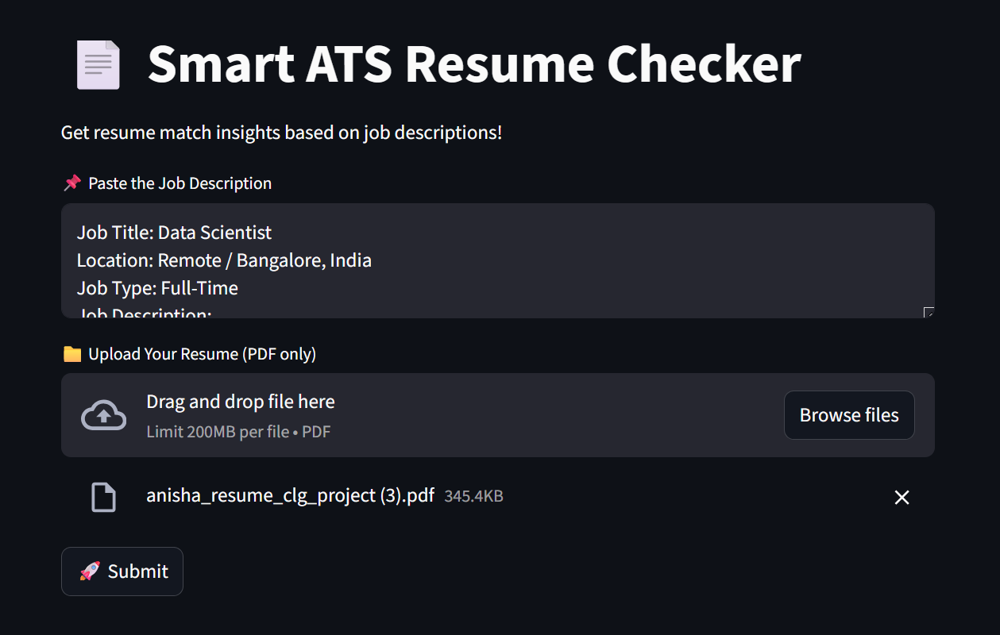

# 📄 Smart ATS Resume Checker

This Streamlit app helps job seekers evaluate how well their resume matches a job description using NLP. It extracts text from PDF resumes using PyPDF2, then applies TextBlob for Part-of-Speech tagging to identify relevant nouns, verbs, and adjectives.

The app uses lemmatization to convert words to their base forms (e.g., "running" → "run") and filters out common stopwords using scikit-learn's ENGLISH_STOP_WORDS to focus on meaningful keywords. 

Then analyzes the resume against the job description to provide a compatibility percentage, identify missing keywords, and suggest profile summary improvements through Streamlit interface.

---

## 🚀 Features

- 📥 Upload resume (PDF format)
- 📝 Paste a job description
- 🔍 Keyword extraction (nouns, verbs, adjectives)
- ❌ Identifies missing keywords
- 📊 Provides JD match percentage
- 🧠 Generates a profile summary using Gemini
- ✅ Simple, clean UI with Streamlit

---

## 🧠 Technologies & NLP Tasks

- **TextBlob**: POS tagging, lemmatization
- **scikit-learn**: Stopword removal
- **PyPDF2**: Extracts text from PDF resumes
- **Google Gemini API**: Semantic analysis and summary generation
- **Streamlit**: Web interface

---

## 🖼️ Demo



## 📦 Installation

1. **Clone the repository**
   ```bash
   git clone https://github.com/Fr0styfeet/smart-ats-checker.git
   cd smart-ats-checker
   ```

2. **Create a virtual environment (optional but recommended)**
   ```bash
   python -m venv venv
   source venv/bin/activate  # On Windows: venv\Scripts\activate
   ```

3. **Install dependencies**
   ```bash
   pip install -r requirements.txt
   ```

4. **Set your Gemini API key**

   Create a `.env` file in the root directory and add:
   ```env
   GOOGLE_API_KEY=your_google_api_key_here
   ```

---

## ▶️ Run the App

```bash
streamlit run app.py
```

---

## 📂 File Structure

```
smart-ats-checker/
│
├── app.py              # Main Streamlit application
├── requirements.txt    # Dependencies
└── README.md           # Project info
```

---

## 🛡️ License

MIT License. Free to use, modify, and distribute.

---

## 💡 Inspiration

Built to assist job seekers in optimizing their resumes using the power of NLP and LLMs.
